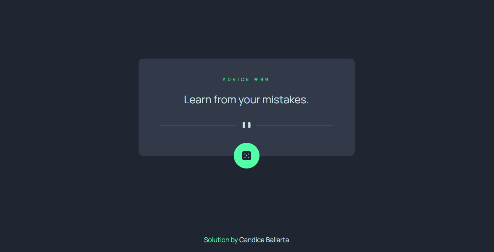

# Frontend Mentor - Advice generator app solution

This is a solution to the [Advice generator app challenge on Frontend Mentor](https://www.frontendmentor.io/challenges/advice-generator-app-QdUG-13db). Frontend Mentor challenges help you improve your coding skills by building realistic projects.

## Table of contents

-   [Overview](#overview)
    -   [The challenge](#the-challenge)
    -   [Screenshot](#screenshot)
    -   [Links](#links)
-   [My process](#my-process)
    -   [Built with](#built-with)
    -   [Continued development](#continued-development)
    -   [Useful resources](#useful-resources)
-   [Author](#author)

## Overview

### The challenge

Users should be able to:

-   View the optimal layout for the app depending on their device's screen size
-   See hover states for all interactive elements on the page
-   Generate a new piece of advice by clicking the dice icon

### Screenshot

### Links

-   Solution URL: [Github Repository](https://github.com/candicejoyballarta/random-advice-app)
-   Live Site URL: [Random Advice App](https://your-live-site-url.com)

## My process

### Built with

-   Semantic HTML5 markup
-   CSS custom properties
-   Flexbox
-   CSS Grid
-   [Vue](https://vuejs.org/) - JS library

### Continued development

I think it would be great if users can also send their own advice. Maybe adding in a simple server could do the trick.

### Useful resources

-   [Vue.js Documentation](https://vuejs.org/guide/introduction.html) - Reading the documentation helped me a lot on the basics of how I can create a basic vue app.
-   [6 Creative Ideas for CSS Link Hover Effects](https://css-tricks.com/css-link-hover-effects/) - This is an amazing article which helped me design custom link hover effects. I'd recommend it to anyone who wants to be a little bit extra on styling their links.

## Author

-   Frontend Mentor - [@yourusername](https://www.frontendmentor.io/profile/candicejoyballarta)
-   Github - [@candicejoyballarta](https://github.com/candicejoyballarta)
